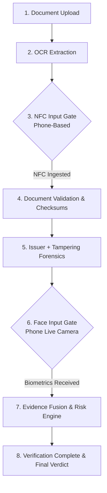
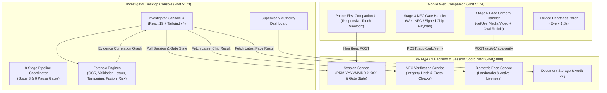

# PRAMAAN

> **TRUST BEYOND DOUBT**  
> **AI-Powered Identity & Document Verification Platform**  
> *Decision-support screening system for border and checkpoint security*

---

## 1. Overview
**PRAMAAN** is an advanced AI-powered identity and document screening platform engineered for frontline border security forces, immigration officers, and checkpoint investigators. PRAMAAN replaces subjective manual checks and fragmented verification tools with a unified forensic pipeline that correlates visual, physical, cryptographic, and biometric evidence to produce explainable risk ratings for human decision-makers.

The core philosophy of PRAMAAN is:
$$\text{EVIDENCE} \longrightarrow \text{CORRELATION} \longrightarrow \text{RISK} \longrightarrow \text{HUMAN DECISION}$$
*(Not a simplistic binary "AI: Real or Fake" assertion).*

---

## 2. SIH Problem Statement
* **Hackathon:** Smart India Hackathon 2026 (SIH 2026)
* **Problem Statement ID:** SIH26188
* **Title:** AI-Based Fake Identity & Document Screening System
* **Primary Target User:** Border / Checkpoint Security Investigator (e.g., SSB, BSF, Bureau of Immigration).
* **Secondary Target User:** Supervisory Authority & Intelligence Administrator.

---

## 3. The Problem
Frontline border checkpoints and immigration counters face severe verification bottlenecks:
1. **Sophisticated Forgeries:** Modern synthetic credentials utilize authentic passport blanks with spliced portraits, altered birth dates, or re-printed biographical text zones that evade visual inspection.
2. **Fragmented Workflows:** Officers must juggle separate MRZ optical readers, stand-alone UV lamps, disconnected database lookups, and biometric cameras without a single correlated dossier.
3. **Black-Box AI Fallacy:** Generic "deep learning fake detector" demos produce unexplainable scores without showing *where* or *why* an anomaly occurred, making them legally inadmissible and operationally unusable.


---

## 4. Proposed Solution
PRAMAAN delivers a complete dual-portal verification architecture:
* **Investigator Console:** A high-throughput, 8-stage forensic screening console providing real-time optical OCR, rule validation, simulated issuer lookups, AI tampering analysis, biometric facial matching, prototype NFC credential cross-checks, specimen reference comparison, and explainable risk scores.
* **Authority Dashboard:** A supervisory intelligence center monitoring checkpoint throughput, fraud trends across states, high-risk case escalations, active investigators, and audit logs.

---

## 5. Key Features
* **8-Stage Verification Pipeline:** Sequential data-driven stages with individual status tracking (`COMPLETED`, `WARNING`, `FAILED`, `PROCESSING`).
* **Visual Forensics Map:** Interactive bounding box overlays pinpointing suspected image splices, font kerning variations, JPEG double-compression boundaries, and guilloche pattern phase shifts.
* **Evidence Fusion Engine:** Consolidates isolated signals across 8 forensic vectors into a transparent evidence correlation graph.
* **Configurable Risk Engine:** Mathematical scoring (0–29 Low, 30–59 Medium, 60–100 High) with explicit point weights and actionable directives.
* **NFC Prototype Credential Module:** Cross-verifies printed document text against digitally signed offline chip credentials.
* **PRADO-Style Document Reference Engine:** Compares uploaded documents against authentic specimen profiles (India, UAE, UK, USA).
* **Simulated Watchlist & LOC Screening:** Flags active Lookout Circulars and stolen travel document alerts.
* **Full Audit Trail & Dossier:** Generates printable, timestamped forensic dossiers for evidentiary handover.

---

## 6. Verification Pipeline (8 Sequential Stages)
The verification pipeline follows an exact 8-stage sequential workflow where **Stage 3 (NFC Input)** and **Stage 6 (Face Input)** operate as real pipeline gates awaiting input from a connected mobile phone:



1. **Stage 1 — Document Upload:** Optical document image ingestion at 300 DPI.
2. **Stage 2 — OCR Extraction:** Visual zone text parsing and MRZ parsing with character confidence scoring.
3. **Stage 3 — NFC Input (From Phone) [GATE]:** Pipeline pauses until NFC chip credential payload is transmitted from a connected phone (`POST /api/v1/nfc/verify`). Cross-verifies chip vs printed optical fields.
4. **Stage 4 — Document Validation:** ICAO 9303 checksum arithmetic, date consistency, and chronology checks.
5. **Stage 5 — Issuer + Tampering Analysis:** Query synthetic issuer database and AI vision tampering detection.
6. **Stage 6 — Face Input (From Phone) [GATE]:** Pipeline pauses until live portrait is captured via connected mobile phone camera (`POST /api/v1/face/verify`). Compares face against document photo and verifies active liveness.
7. **Stage 7 — Evidence Fusion + Risk Assessment:** Correlates all 8 forensic vectors and executes mathematical risk engine.
8. **Stage 8 — Verification Complete:** Generates final risk score (0–100), verdict (PASSED / REVIEW / FLAGGED), and evidence dossier.

---

## 7. System Architecture (Multi-Device LAN Mesh)


---

## 8. Frontend Architecture
* **Framework:** React 19 (`react`, `react-dom`) with TypeScript (`~6.0`).
* **Bundler & Dev Server:** Vite 8 (`@vitejs/plugin-react`).
* **Styling:** Vanilla Tailwind CSS v4 with curated dark navy palette (`#071A2F`, `#0B213A`), emergency red accents (`#DC2626`), and terminal green indicators (`#16A34A`).
* **Icons:** Lucide React (`lucide-react`).
* **Linter & Code Quality:** Oxlint (`oxlint`), maintaining 0 errors and 0 warnings.
* **Component Architecture:** Strict separation between presentation cards (`OcrExtractionCard`, `TamperingAnalysisCard`, `RiskAssessmentCard`) and verification services.

---

## 9. AI/ML Architecture
PRAMAAN adopts an adapter-based architecture for forensic AI:
$$\text{TamperingService} \longrightarrow \text{Baseline Analyzer (Heuristics)} \longrightarrow \text{Future ML Model API}$$

### Forensic Indicators Evaluated:
1. **Photo Replacement & Edge Gradient Discontinuity:** Detects digital splicing along the portrait bounding box.
2. **Sub-pixel Font Inconsistency:** Detects character replacements in Date of Birth (DOB) and numerical fields where font kerning or compression grids diverge.
3. **Double Compression Grid Boundaries:** Detects localized re-saving artifacts via Error Level Analysis (ELA).
4. **Guilloche Security Micro-pattern Phase Shifts:** Flags interruptions in continuous wavy background lines.

*Status: Implemented as a high-fidelity baseline simulator with clean adapter interfaces ready for PyTorch/TensorFlow backend connection.*

---

## 10. NFC Credential Input & Cross-Verification (Stage 3 Gate)
* **Designation:** NFC-Based Prototype Credential Verification (Frontline Gate).
* **Pipeline Behavior:** The verification pipeline strictly **pauses** at Stage 3 until physical or simulated chip data is transmitted from a connected mobile device.
* **Phone Integration:**
  * **Web NFC Hardware Scanning:** Android Chrome users can tap a physical NFC tag (`NDEFReader.scan()`) to transmit live chip serial and records.
  * **One-Tap Prototype Payload:** Companion provides 1-tap transmission of genuine and tampered test credentials signed with public trust anchors.
  * **Endpoint:** `POST /api/v1/nfc/verify` correlates chip data against optical OCR text.
* **Anomaly Detection:** If printed optical text has been altered (e.g., printed DOB reads `14/02/1999`, but the digitally signed chip records `14/02/1998`), the system raises an `NFC CROSS-VERIFICATION MISMATCH` warning (+20 risk score).
* **Cryptographic Integrity:** Validates SHA-256 integrity hashes without exposing private keys.

---

## 11. Biometric Face Verification & Live Mobile Camera (Stage 6 Gate)
* **Designation:** Live Mobile Camera Biometric Verification (Frontline Gate).
* **Pipeline Behavior:** The verification pipeline strictly **pauses** at Stage 6 until a live facial portrait is captured on the connected phone.
* **Phone Integration:**
  * **Live Viewfinder:** Employs `navigator.mediaDevices.getUserMedia` with front-facing camera (`facingMode: 'user'`).
  * **Visual Guidance:** Displays a live oval face guideline overlay and lighting instructions.
  * **Biometric Extraction:** Captures video frame to canvas, converts to high-resolution JPEG, and posts to `POST /api/v1/face/verify`.
  * **Fallbacks:** Includes mobile file picker camera fallback (`<input type="file" capture="user">`) and one-tap biometric likeness testing for non-HTTPS local networks.
* **Forensics Evaluated:** 68-point facial landmark distance vectors against document portrait photo and active liveness verification (`PASS` / `REVIEW` / `FAIL`).

---

## 12. Document Reference Engine
* **Designation:** PRADO-Style Document Reference Comparison.
* **Functionality:** Compares an uploaded document against authentic specimen baseline profiles:
  * Republic of India (`IND`): Passport (Series P TD3) & Consular Visa Sticker.
  * United Arab Emirates (`ARE`): e-Passport 2024.
  * United Kingdom (`GBR`): Polycarbonate Series C Passport.
  * United States (`USA`): Next Generation Passport (NGP).
* **Checks:** Compares layout geometry, aspect ratio (1.42:1), portrait coordinates, Ashoka Lion watermark density, and microprint continuous text.

*Status: Implemented with offline multi-country specimen catalog.*

---

## 13. Issuer Verification (Simulated)
* **Designation:** Simulated Issuer Verification Service.
* **Scope:** Simulates document existence checks, status lookups (`ACTIVE`, `EXPIRED`, `REVOKED`), blacklist screenings, and digital signature authentication.
* **Disclaimer:** Explicitly labeled in the UI as *Simulated Issuer Data — not a live government database*.
* **Architecture:** Implements `IssuerServiceAdapter` enabling 1-line replacement with live MEA/Passport Seva APIs.

*Status: Implemented with simulation adapter.*

---

## 14. Evidence Fusion
Combines all 8 verification vectors into a unified evidence graph:
| Vector | Status | Impact Weight | Technical Finding |
|---|---|---|---|
| **OCR** | PASS / WARNING / FAIL | 0–15 pts | Optical confidence & character segmentations |
| **Validation** | PASS / WARNING / FAIL | 0–25 pts | ICAO 9303 checksums & chronological sequence |
| **Issuer** | PASS / FAIL | 0–40 pts | Simulated registry status & revocation state |
| **Tampering** | PASS / WARNING / FAIL | 0–45 pts | AI photo splicing, sub-pixel text, compression |
| **Face** | PASS / REVIEW / FAIL | 0–35 pts | 68-point landmark match & active liveness |
| **NFC** | PASS / WARNING / FAIL | 0–30 pts | Printed vs signed chip credential cross-check |
| **Reference** | PASS / WARNING / FAIL | 0–20 pts | PRADO specimen layout & watermark alignment |
| **Watchlist** | PASS / FAIL | 0–50 pts | Lookout Circular (LOC) & adverse list check |

---

## 15. Risk Scoring
* **Range:** 0 to 100
* **Levels:**
  * `0 – 29`: **LOW RISK** (Likely clear — Standard processing)
  * `30 – 59`: **MEDIUM RISK** (Manual review recommended — Secondary scrutiny)
  * `60 – 100`: **HIGH RISK** (Detailed forensic inspection recommended — Supervisory escalation)
* **Transparency:** Every point added is accounted for in the Risk Engine Matrix (e.g. `+35 Photo manipulation`, `+20 NFC DOB mismatch`, `+10 Guilloche phase shift`).

---

## 16. Investigator Workflow
1. **Capture / Select:** Upload scanned image, capture via optical camera scan modal, or select a demo scenario.
2. **Automated Analysis:** Click **Run Pipeline**; the 8-stage sequence executes with real-time audit logging.
3. **Inspect Anomalies:** Review highlighted bounding boxes on document view and inspect suspicious elements.
4. **Dossier Review:** Open the **Detailed Report Modal** to examine NFC data, PRADO comparison, and audit trail.
5. **Human Decision:**
   * **Save to Records:** Archives case into tamper-evident local repository.
   * **Flag for Investigation:** Escalates case to supervisor with broadcast alert.
   * **Clear:** Resets console for next screening.

---

## 17. Authority Dashboard
Dedicated supervisory portal providing strategic border intelligence:
* **KPI Metrics:** Total Verifications, High-Risk Cases, Active Investigators, Cleared Documents.
* **Visual Analytics:** 7-day Verification Trends chart, Risk Distribution donut, Document Types ratio.
* **Recent High-Risk Cases:** Dynamic table populated directly from investigator actions.
* **Geographical Statistics:** Interactive state-level breakdown across Indian checkpoints (Delhi, Mumbai, Raxaul, Amritsar, Kolkata, Chennai).
* **Active Investigators:** Live duty statuses, clearance rates, and station assignments.
* **Audit & Quick Actions:** Broadcast alerts, generate compliance reports, update watchlist definitions.

---

## 18. Project Structure
```
c:\Pramaan\
├── README.md                      # Unified platform documentation
├── backend/                       # Express 5 REST API & Multi-Device Session Coordinator
│   ├── package.json               # Backend dependencies & npm test scripts
│   ├── src/
│   │   ├── server.js              # Server bootstrapper (Port 5000)
│   │   ├── app.js                 # Express application & CORS configuration
│   │   ├── config/                # Environment configuration
│   │   ├── controllers/
│   │   │   ├── sessionController.js # Session state & heartbeat endpoints
│   │   │   ├── nfcController.js     # NFC credential verification & cross-checks
│   │   │   ├── faceController.js    # Biometric likeness & liveness analysis
│   │   │   ├── documentController.js# Document upload & retrieval
│   │   │   └── authController.js    # JWT authentication for officers
│   │   ├── services/
│   │   │   ├── sessionService.js    # In-memory session coordinator
│   │   │   ├── nfcService.js        # Prototype NFC verification logic
│   │   │   ├── faceService.js       # Face likeness & liveness algorithms
│   │   │   └── storageService.js    # Local & Supabase storage adapter
│   │   ├── routes/                  # REST route definitions (/api/v1/*)
│   │   └── middlewares/             # Auth, error, and rate-limiting handlers
│   └── tests/
│       ├── health.test.js         # Health & SHA-256 HMAC integrity tests
│       ├── integration.test.js    # Auth & document upload integration tests
│       └── pipeline_gates.test.js # Stage 3 NFC & Stage 6 Face gate tests
├── frontend/                      # Desktop Investigator Console & Authority Dashboard
│   ├── index.html                 # HTML5 entry point
│   ├── vite.config.ts             # Vite 8 configuration (Port 5173, host: 0.0.0.0)
│   ├── package.json               # Dependencies and scripts
│   ├── tsconfig.json              # TypeScript root config
│   ├── .oxlintrc.json             # Oxlint configuration
│   └── src/
│       ├── main.tsx               # React application root
│       ├── App.tsx                # 8-stage sequential pipeline runner & router
│       ├── App.css / index.css    # Design tokens & styling
│       ├── types/                 # Central TypeScript type definitions
│       ├── services/              # Forensic verification engines
│       │   ├── apiClient.ts       # Backend REST client & session sync
│       │   ├── verificationService.ts # Central orchestration facade
│       │   ├── ocrEngine.ts       # Optical character & MRZ extraction
│       │   ├── validationEngine.ts # ICAO 9303 checksums & rule validation
│       │   ├── issuerService.ts   # Simulated issuer adapter
│       │   ├── tamperingService.ts # AI tampering baseline adapter
│       │   ├── faceService.ts     # Biometric face matching & liveness
│       │   ├── nfcService.ts      # Prototype NFC credential verification
│       │   ├── evidenceFusion.ts  # Multi-vector evidence fusion
│       │   └── riskEngine.ts      # Configurable weighted risk engine
│       ├── data/                  # Mock data & 5 demonstration scenarios
│       ├── pages/
│       │   └── AuthorityDashboard.tsx # Supervisory command center
│       └── components/            # UI components
│           ├── PipelineProgress.tsx      # 8-step pipeline timeline
│           ├── DocumentUploadCard.tsx    # Upload & scenario selector
│           ├── OcrExtractionCard.tsx     # Extracted OCR fields & confidence
│           ├── NfcVerificationCard.tsx   # Stage 3 NFC gate card
│           ├── DocumentValidationCard.tsx # Validation check rules
│           ├── IssuerVerificationCard.tsx # Issuer status card
│           ├── TamperingAnalysisCard.tsx  # AI forensic analysis card
│           ├── FaceVerificationCard.tsx   # Stage 6 Face biometric card
│           ├── RiskAssessmentCard.tsx    # Semi-circular risk gauge
│           ├── AiSummaryCard.tsx         # Concise natural-language summary
│           ├── DetailedReportModal.tsx   # Multi-tab forensic dossier
│           └── PastRecordsModal.tsx      # Archived records browser
└── mobile-web/                    # Phone-First Mobile Web Companion
    ├── index.html                 # Mobile-optimized viewport entry
    ├── vite.config.ts             # Vite 8 configuration (Port 5174, host: 0.0.0.0)
    ├── package.json               # Companion dependencies
    ├── tsconfig.json              # TypeScript configuration
        ├── main.tsx               # Companion application root
        ├── App.tsx                # Dynamic 8-stage mobile flow & heartbeat
        ├── index.css              # Custom radar, scanline & oval reticle styling
        ├── services/
        │   └── api.ts             # Backend communication & session polling
        └── components/
            ├── Header.tsx         # PRAMAAN Mobile header & connection pulse
            ├── SettingsModal.tsx  # Backend IP config & session selector
            ├── StatusTimeline.tsx # Visual 8-step timeline with gate markers
            ├── NfcScreen.tsx      # Stage 3 NFC reader (Web NFC + 1-tap chip)
            └── FaceCameraScreen.tsx # Stage 6 live camera capture (getUserMedia)
```

---

## 19. Technology Stack
* **Investigator Desktop Console (`frontend/`):**
  * React 19.2.8 (`react`, `react-dom`)
  * TypeScript 6.0 (`typescript`)
  * Vite 8.2.2 (`vite`, `@vitejs/plugin-react`)
  * Tailwind CSS 4.3.3 (`tailwindcss`, `@tailwindcss/vite`)
  * Lucide React 1.41.0 (`lucide-react`)
  * Canvas Confetti 1.9.4 (`canvas-confetti`)
  * Oxlint 1.79.0 (`oxlint`)
* **Mobile Web Companion (`mobile-web/`):**
  * React 19.2.8 (`react`, `react-dom`)
  * TypeScript 6.0 (`typescript`)
  * Vite 8.2.2 (`vite`, `@vitejs/plugin-react`)
  * Tailwind CSS 4.3.3 (`tailwindcss`, `@tailwindcss/vite`)
  * Lucide React 1.41.0 (`lucide-react`)
  * Web NFC API (`NDEFReader`) for hardware chip reading
  * MediaDevices Camera API (`navigator.mediaDevices.getUserMedia`)
* **Backend API & Session Coordinator (`backend/`):**
  * Node.js v24 (ES Modules)
  * Express 5.2.1 (`express`)
  * Express Rate Limit 8.7.0 (`express-rate-limit`)
  * Helmet 8.3.0 (`helmet`)
  * CORS 2.8.6 (`cors`)
  * Multer 2.3.0 (`multer`) for secure multipart document uploads
  * Supabase Client 2.115.0 (`@supabase/supabase-js`)
  * Axios 1.20.0 (`axios`)
  * UUID 14.0.2 (`uuid`)

---

## 20. REST API Reference (Multi-Device Coordination)
The backend acts as the single source of truth for pipeline sessions and gate inputs:

### Session Coordination
| Method | Endpoint | Description |
|---|---|---|
| `GET` | `/api/v1/session/current` | Retrieve the active verification session and connection state |
| `POST` | `/api/v1/session/init` | Create or reset a new session ID (`PRM-YYYYMMDD-XXXX`) |
| `GET` | `/api/v1/session/:sessionId` | Poll full session status, stage, document metadata, and gate results |
| `POST` | `/api/v1/session/:sessionId/heartbeat` | Mobile device heartbeat (updates `phoneConnected: true`) |
| `POST` | `/api/v1/session/:sessionId/stage` | Desktop updates current stage (1–8) and status flags |
| `POST` | `/api/v1/session/:sessionId/request-face` | Broadcast signal to phone to activate live camera |
| `POST` | `/api/v1/session/:sessionId/reset` | Clear active session state |

### Stage 3 NFC Gate
| Method | Endpoint | Description |
|---|---|---|
| `POST` | `/api/v1/nfc/verify` | Ingest chip data from phone, cross-verify vs printed fields, and store result |
| `GET` | `/api/v1/nfc/latest?sessionId=...` | Poll latest NFC verification result for desktop console |

### Stage 6 Face Gate
| Method | Endpoint | Description |
|---|---|---|
| `POST` | `/api/v1/face/verify` | Ingest live camera photo from phone, execute likeness & liveness scoring |
| `GET` | `/api/v1/face/latest?sessionId=...` | Poll latest Face verification result for desktop console |

---

## 21. Installation
Prerequisites: Node.js (v18+ recommended) and npm.

```bash
# Clone the repository
git clone https://github.com/mokshit510/Collaboration-learning.git
cd Collaboration-learning

# 1. Install Backend dependencies
cd backend && npm install && cd ..

# 2. Install Desktop Frontend dependencies
cd frontend && npm install && cd ..

# 3. Install Mobile Web Companion dependencies
cd mobile-web && npm install && cd ..
```

---

## 22. Running Locally & Over LAN
For the complete 8-stage verification with phone-based NFC and Face gates, run the three services concurrently:

```bash
# Terminal 1: PRAMAAN Backend (Session, NFC & Face APIs)
cd backend
npm run dev
# Running on http://0.0.0.0:5000

# Terminal 2: Investigator Desktop Console
cd frontend
npm run dev
# Running on http://0.0.0.0:5173

# Terminal 3: Mobile Web Companion (Phone NFC & Face Input)
cd mobile-web
npm run dev
# Running on http://0.0.0.0:5174
```

### Accessing From Mobile Phone
Connect your mobile device to the same Wi-Fi network as your workstation:
1. Open `http://<YOUR_LOCAL_IP>:5174` (e.g. `http://192.168.166.12:5174`) in your mobile browser.
2. In the Mobile Companion, confirm the backend address (default is `http://<YOUR_LOCAL_IP>:5000`).
3. As the desktop console runs Stage 1 & 2, the phone automatically updates to **Stage 3 (NFC Input)** and prompts for chip read or 1-tap transmission.
4. After Stage 4 & 5 complete on desktop, the phone automatically activates **Stage 6 (Live Face Camera)** to capture biometrics and complete the pipeline.

---

## 23. Environment Variables
Create a `.env` file in `frontend/` (see `.env.example`):
```ini
# Toggle between standalone demo mode and backend integration
VITE_USE_MOCK=true

# Remote backend API Base URL (used when VITE_USE_MOCK=false)
VITE_API_BASE_URL=http://localhost:5000
```

---

## 24. Mock Mode vs Live Backend Mode
* **When `VITE_USE_MOCK=true` (Default):**
  PRAMAAN operates autonomously using local modular engines (`OcrEngine`, `ValidationEngine`, `BaselineTamperingAnalyzer`, `MockNfcAdapter`, `ReferenceEngine`, `WatchlistService`). No external server is required.
* **When `VITE_USE_MOCK=false`:**
  `apiClient.ts` dispatches requests to backend endpoints (`/api/v1/session`, `/api/v1/nfc`, `/api/v1/face`, `/api/v1/documents`).

---

## 25. Demo Scenarios
PRAMAAN includes 5 realistic scenarios selectable directly from the **Scenario Selector** dropdown in the Document Upload card:
1. **Scenario 1: Genuine Document (LOW RISK)**
   * All checks pass, 96% biometric likeness, identical NFC chip data, no anomalies detected. Final Risk: ~12/100 (LOW).
2. **Scenario 2: Tampered Identity & DOB (HIGH RISK)**
   * AI flags photo border splicing and DOB numerical glyph variance. NFC credential reveals DOB mismatch (`14/02/1999` printed vs `14/02/1998` on chip). Final Risk: 78/100 (HIGH).
3. **Scenario 3: Expired Travel Document (HIGH RISK)**
   * Temporal validation check and simulated issuer flag document as expired (01/01/2025). Final Risk: 68/100 (HIGH).
4. **Scenario 4: Watchlist / Lookout Alert (HIGH RISK)**
   * Document and identity match simulated high-priority Lookout Circular (LOC) for financial fraud. Action directive issued. Final Risk: 92/100 (HIGH).
5. **Scenario 5: Degraded OCR / Optical Scan (MEDIUM RISK)**
   * Specular glare and sensor noise reduce average character confidence (<75%). Secondary checksum flagged for manual review. Final Risk: 44/100 (MEDIUM).

---

## 26. Security & Privacy
* **Zero PII Exposure:** Document numbers are masked in all lists (`T123****`).
* **Cryptographic Security:** NFC credentials verify public trust anchors without bundling private keys.
* **Environment Protection:** `.env`, `.env.*`, keys, and tokens are strictly excluded in `.gitignore`.
* **Synthetic Data:** All demo documents use synthetic biographical identities.

---

## 27. Current Limitations
* NFC module uses a web simulation adapter; physical NFC reading requires WebNFC API in supported Chromium browsers with compatible hardware.
* Optical character recognition in standalone mock mode uses local parsed streams; deep non-standard handwriting requires connection to backend OCR model.
* Issuer and Watchlist checks are simulated and do not query production government databases.

---

## 28. Future Scope
* **Hardware Integration:** Integration with dedicated 3M / Thales full-page passport scanners and smart card readers.
* **Edge Inference:** Deployment of lightweight quantized Vision Transformer (ViT) tampering models directly on edge checkpoint terminals.
* **Consular Blockchain:** Consortium permissioned ledger for cross-border tamper-proof credential issuance.
* **Multi-Modal Biometrics:** Expansion to iris scanning and 10-finger fingerprint verification.

---

## 29. Team Roles & Integration Guidelines
* **Frontend Lead:** Complete React 19 UI, dual portals, 8-step pipeline, and dossier modals.
* **Backend Teammate Integration:**
  * Implement endpoints defined in `src/services/apiClient.ts` (`POST /api/v1/verification`, `/api/v1/nfc/verify`, `/api/v1/face/verify`).
  * Set `VITE_USE_MOCK=false` and `VITE_API_BASE_URL` to point to the backend server.
* **AI/ML Teammate Integration:**
  * Connect deep learning tampering models (e.g. ELA + Vision Transformer) to `TamperingService` by implementing `TamperingAnalyzerAdapter` in `src/services/tamperingService.ts`.

---

## 30. Hackathon Information
* **Event:** Smart India Hackathon 2026 (SIH 2026)
* **Problem Statement:** SIH26188 — AI-Based Fake Identity & Document Screening System
* **Theme:** Security & Surveillance / Smart Governance
* **Category:** Software Edition

---

## 31. Disclaimer
> "PRAMAAN is a Smart India Hackathon / research prototype. Issuer verification, watchlist data, NFC credentials and reference data are simulated unless explicitly connected to an authorized production service. The system is designed as a decision-support and screening tool and does not replace official identity, immigration or law-enforcement systems."


