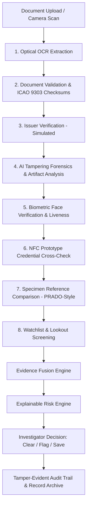
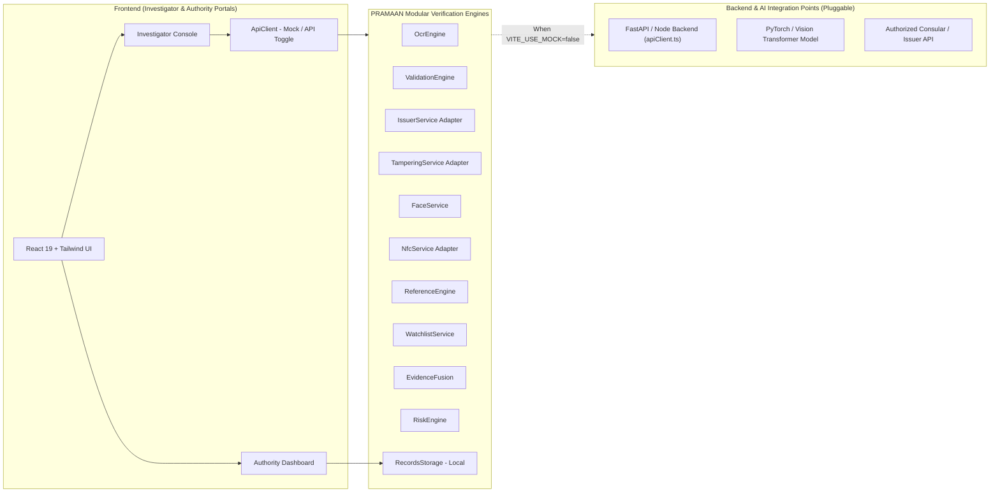

# PRAMAAN

> **TRUST BEYOND DOUBT**  
> **AI-Powered Identity & Document Verification Platform**  
> *Decision-support screening system for border and checkpoint security*

---

## 1. Overview
**PRAMAAN** is an advanced AI-powered identity and document screening platform engineered for frontline border security forces, immigration officers, and checkpoint investigators. PRAMAAN replaces subjective manual checks and fragmented verification tools with a unified forensic pipeline that correlates visual, physical, cryptographic, and biometric evidence to produce explainable risk ratings for human decision-makers.

The core philosophy of PRAMAAN is:
$$\text{EVIDENCE} \longrightarrow \text{CORRELATION} \longrightarrow \text{RISK} \longrightarrow \text{HUMAN DECISION}$$
*(Not a simplistic binary "AI: Real or Fake" assertion).*

---

## 2. SIH Problem Statement
* **Hackathon:** Smart India Hackathon 2026 (SIH 2026)
* **Problem Statement ID:** SIH26188
* **Title:** AI-Based Fake Identity & Document Screening System
* **Primary Target User:** Border / Checkpoint Security Investigator (e.g., SSB, BSF, Bureau of Immigration).
* **Secondary Target User:** Supervisory Authority & Intelligence Administrator.

---

## 3. The Problem
Frontline border checkpoints and immigration counters face severe verification bottlenecks:
1. **Sophisticated Forgeries:** Modern synthetic credentials utilize authentic passport blanks with spliced portraits, altered birth dates, or re-printed biographical text zones that evade visual inspection.
2. **Fragmented Workflows:** Officers must juggle separate MRZ optical readers, stand-alone UV lamps, disconnected database lookups, and biometric cameras without a single correlated dossier.
3. **Black-Box AI Fallacy:** Generic "deep learning fake detector" demos produce unexplainable scores without showing *where* or *why* an anomaly occurred, making them legally inadmissible and operationally unusable.


---

## 4. Proposed Solution
PRAMAAN delivers a complete dual-portal verification architecture:
* **Investigator Console:** A high-throughput, 8-stage forensic screening console providing real-time optical OCR, rule validation, simulated issuer lookups, AI tampering analysis, biometric facial matching, prototype NFC credential cross-checks, specimen reference comparison, and explainable risk scores.
* **Authority Dashboard:** A supervisory intelligence center monitoring checkpoint throughput, fraud trends across states, high-risk case escalations, active investigators, and audit logs.

---

## 5. Key Features
* **8-Stage Verification Pipeline:** Sequential data-driven stages with individual status tracking (`COMPLETED`, `WARNING`, `FAILED`, `PROCESSING`).
* **Visual Forensics Map:** Interactive bounding box overlays pinpointing suspected image splices, font kerning variations, JPEG double-compression boundaries, and guilloche pattern phase shifts.
* **Evidence Fusion Engine:** Consolidates isolated signals across 8 forensic vectors into a transparent evidence correlation graph.
* **Configurable Risk Engine:** Mathematical scoring (0–29 Low, 30–59 Medium, 60–100 High) with explicit point weights and actionable directives.
* **NFC Prototype Credential Module:** Cross-verifies printed document text against digitally signed offline chip credentials.
* **PRADO-Style Document Reference Engine:** Compares uploaded documents against authentic specimen profiles (India, UAE, UK, USA).
* **Simulated Watchlist & LOC Screening:** Flags active Lookout Circulars and stolen travel document alerts.
* **Full Audit Trail & Dossier:** Generates printable, timestamped forensic dossiers for evidentiary handover.

---

## 6. Verification Pipeline
The verification flow strictly enforces evidence-based correlation:



---

## 7. System Architecture


---

## 8. Frontend Architecture
* **Framework:** React 19 (`react`, `react-dom`) with TypeScript (`~6.0`).
* **Bundler & Dev Server:** Vite 8 (`@vitejs/plugin-react`).
* **Styling:** Vanilla Tailwind CSS v4 with curated dark navy palette (`#071A2F`, `#0B213A`), emergency red accents (`#DC2626`), and terminal green indicators (`#16A34A`).
* **Icons:** Lucide React (`lucide-react`).
* **Linter & Code Quality:** Oxlint (`oxlint`), maintaining 0 errors and 0 warnings.
* **Component Architecture:** Strict separation between presentation cards (`OcrExtractionCard`, `TamperingAnalysisCard`, `RiskAssessmentCard`) and verification services.

---

## 9. AI/ML Architecture
PRAMAAN adopts an adapter-based architecture for forensic AI:
$$\text{TamperingService} \longrightarrow \text{Baseline Analyzer (Heuristics)} \longrightarrow \text{Future ML Model API}$$

### Forensic Indicators Evaluated:
1. **Photo Replacement & Edge Gradient Discontinuity:** Detects digital splicing along the portrait bounding box.
2. **Sub-pixel Font Inconsistency:** Detects character replacements in Date of Birth (DOB) and numerical fields where font kerning or compression grids diverge.
3. **Double Compression Grid Boundaries:** Detects localized re-saving artifacts via Error Level Analysis (ELA).
4. **Guilloche Security Micro-pattern Phase Shifts:** Flags interruptions in continuous wavy background lines.

*Status: Implemented as a high-fidelity baseline simulator with clean adapter interfaces ready for PyTorch/TensorFlow backend connection.*

---

## 10. NFC Prototype
* **Designation:** Secure NFC Document Credential — Demonstration Module.
* **Concept:** Demonstrates offline verification where an embedded NFC credential payload is cryptographically authenticated and cross-referenced with optical OCR text.
* **Anomaly Detection:** If printed text has been forged (e.g., printed DOB reads `14/02/1999`, but the digitally signed chip payload records `14/02/1998`), the system raises a critical `NFC CROSS-VERIFICATION MISMATCH` warning.
* **Integrity:** Validates cryptographic SHA-256 integrity hashes against simulated offline trust anchors without exposing private keys in client code.

*Status: Implemented as clean prototype adapter.*

---

## 11. Document Reference Engine
* **Designation:** PRADO-Style Document Reference Comparison.
* **Functionality:** Compares an uploaded document against authentic specimen baseline profiles:
  * Republic of India (`IND`): Passport (Series P TD3) & Consular Visa Sticker.
  * United Arab Emirates (`ARE`): e-Passport 2024.
  * United Kingdom (`GBR`): Polycarbonate Series C Passport.
  * United States (`USA`): Next Generation Passport (NGP).
* **Checks:** Compares layout geometry, aspect ratio (1.42:1), portrait coordinates, Ashoka Lion watermark density, and microprint continuous text.

*Status: Implemented with offline multi-country specimen catalog.*

---

## 12. Issuer Verification
* **Designation:** Simulated Issuer Verification Service.
* **Scope:** Simulates document existence checks, status lookups (`ACTIVE`, `EXPIRED`, `REVOKED`), blacklist screenings, and digital signature authentication.
* **Disclaimer:** Explicitly labeled in the UI as *Simulated Issuer Data — not a live government database*.
* **Architecture:** Implements `IssuerServiceAdapter` enabling 1-line replacement with live MEA/Passport Seva APIs.

*Status: Implemented with simulation adapter.*

---

## 13. Evidence Fusion
Combines all 8 verification vectors into a unified evidence graph:
| Vector | Status | Impact Weight | Technical Finding |
|---|---|---|---|
| **OCR** | PASS / WARNING / FAIL | 0–15 pts | Optical confidence & character segmentations |
| **Validation** | PASS / WARNING / FAIL | 0–25 pts | ICAO 9303 checksums & chronological sequence |
| **Issuer** | PASS / FAIL | 0–40 pts | Simulated registry status & revocation state |
| **Tampering** | PASS / WARNING / FAIL | 0–45 pts | AI photo splicing, sub-pixel text, compression |
| **Face** | PASS / REVIEW / FAIL | 0–35 pts | 68-point landmark match & active liveness |
| **NFC** | PASS / WARNING / FAIL | 0–30 pts | Printed vs signed chip credential cross-check |
| **Reference** | PASS / WARNING / FAIL | 0–20 pts | PRADO specimen layout & watermark alignment |
| **Watchlist** | PASS / FAIL | 0–50 pts | Lookout Circular (LOC) & adverse list check |

---

## 14. Risk Scoring
* **Range:** 0 to 100
* **Levels:**
  * `0 – 29`: **LOW RISK** (Likely clear — Standard processing)
  * `30 – 59`: **MEDIUM RISK** (Manual review recommended — Secondary scrutiny)
  * `60 – 100`: **HIGH RISK** (Detailed forensic inspection recommended — Supervisory escalation)
* **Transparency:** Every point added is accounted for in the Risk Engine Matrix (e.g. `+35 Photo manipulation`, `+20 NFC DOB mismatch`, `+10 Guilloche phase shift`).

---

## 15. Investigator Workflow
1. **Capture / Select:** Upload scanned image, capture via optical camera scan modal, or select a demo scenario.
2. **Automated Analysis:** Click **Run Pipeline**; the 8-stage sequence executes with real-time audit logging.
3. **Inspect Anomalies:** Review highlighted bounding boxes on document view and inspect suspicious elements.
4. **Dossier Review:** Open the **Detailed Report Modal** to examine NFC data, PRADO comparison, and audit trail.
5. **Human Decision:**
   * **Save to Records:** Archives case into tamper-evident local repository.
   * **Flag for Investigation:** Escalates case to supervisor with broadcast alert.
   * **Clear:** Resets console for next screening.

---

## 16. Authority Dashboard
Dedicated supervisory portal providing strategic border intelligence:
* **KPI Metrics:** Total Verifications, High-Risk Cases, Active Investigators, Cleared Documents.
* **Visual Analytics:** 7-day Verification Trends chart, Risk Distribution donut, Document Types ratio.
* **Recent High-Risk Cases:** Dynamic table populated directly from investigator actions.
* **Geographical Statistics:** Interactive state-level breakdown across Indian checkpoints (Delhi, Mumbai, Raxaul, Amritsar, Kolkata, Chennai).
* **Active Investigators:** Live duty statuses, clearance rates, and station assignments.
* **Audit & Quick Actions:** Broadcast alerts, generate compliance reports, update watchlist definitions.

---

## 17. Project Structure
```
c:\Pramaan\
├── README.md                      # Root project documentation
├── package.json                   # Root package definition
└── frontend/
    ├── README.md                  # Frontend documentation
    ├── index.html                 # HTML5 entry point
    ├── vite.config.ts             # Vite 8 configuration
    ├── package.json               # Dependencies and scripts
    ├── tsconfig.json              # TypeScript root config
    ├── .oxlintrc.json             # Oxlint rules
    ├── .env.example               # Environment variables template
    └── src/
        ├── main.tsx               # React application root
        ├── App.tsx                # Investigator Console & Portal Router
        ├── App.css / index.css    # Design tokens & styling
        ├── types/                 # Central TypeScript type definitions
        │   ├── index.ts           # VerificationResult, DocumentData, etc.
        │   └── authority.ts       # Authority analytics types
        ├── services/              # Modular verification engines
        │   ├── apiClient.ts       # Backend REST client (Mock/API toggle)
        │   ├── verificationService.ts # Central orchestration facade
        │   ├── ocrEngine.ts       # Optical character & MRZ extraction
        │   ├── validationEngine.ts # ICAO 9303 checksums & rule validation
        │   ├── issuerService.ts   # Simulated issuer adapter
        │   ├── tamperingService.ts # AI tampering baseline adapter
        │   ├── faceService.ts     # Biometric face matching & liveness
        │   ├── nfcService.ts      # Prototype NFC credential verification
        │   ├── referenceEngine.ts # PRADO specimen reference comparison
        │   ├── watchlistService.ts # Lookout Circular (LOC) screening
        │   ├── evidenceFusion.ts  # Multi-vector evidence fusion
        │   ├── riskEngine.ts      # Configurable weighted risk engine
        │   └── recordsStorage.ts  # Persisted records repository
        ├── data/                  # Mock data & demonstration scenarios
        │   ├── demoScenarios.ts   # 5 selectable demo scenarios
        │   ├── mockVerificationData.ts # Specimen documents (Passport, Visa)
        │   └── authorityData.ts   # Authority portal statistics & feeds
        ├── pages/
        │   └── AuthorityDashboard.tsx # Supervisory authority command center
        └── components/            # UI components
            ├── PipelineProgress.tsx      # 8-step data-driven pipeline timeline
            ├── DocumentUploadCard.tsx    # Upload & scenario selector
            ├── PassportDocumentView.tsx  # Document visualizer & tamper overlay
            ├── OcrExtractionCard.tsx     # Extracted OCR fields & confidence
            ├── DocumentValidationCard.tsx # Validation check rules
            ├── IssuerVerificationCard.tsx # Issuer status card
            ├── TamperingAnalysisCard.tsx  # AI forensic analysis card
            ├── FaceVerificationCard.tsx   # Facial match card
            ├── RiskAssessmentCard.tsx    # Semi-circular risk gauge
            ├── AiSummaryCard.tsx         # Concise natural-language summary
            ├── ActionButtons.tsx         # Save, Flag, Clear controls
            ├── DetailedReportModal.tsx   # Multi-tab forensic dossier
            ├── CameraScanModal.tsx       # Live camera scanning viewfinder
            ├── PastRecordsModal.tsx      # Archived records browser
            ├── Toast.tsx                 # Notification alerts
            ├── Sidebar.tsx / Header.tsx  # Layout components
            └── authority/                # Authority dashboard widgets
```

---

## 18. Technology Stack
Actual dependencies verified from `package.json`:
* **Core:** React 19.2.8 (`react`, `react-dom`)
* **Language:** TypeScript 6.0 (`typescript`)
* **Build Tool:** Vite 8.2.2 (`vite`, `@vitejs/plugin-react`)
* **Styling:** Tailwind CSS 4.3.3 (`tailwindcss`, `@tailwindcss/vite`)
* **Iconography:** Lucide React 1.41.0 (`lucide-react`)
* **Visual Effects:** Canvas Confetti 1.9.4 (`canvas-confetti`)
* **Linter:** Oxlint 1.79.0 (`oxlint`)

---

## 19. Installation
Prerequisites: Node.js (v18+ recommended) and npm.

```bash
# Clone the repository
git clone https://github.com/mokshit510/Collaboration-learning.git
cd Collaboration-learning/frontend

# Install dependencies
npm install
```

---

## 20. Running Locally
```bash
# Start local Vite development server
npm run dev

# Build production bundle with TypeScript verification
npm run build

# Run Oxlint code analysis
npm run lint
```

---

## 21. Environment Variables
Create a `.env` file in `frontend/` (see `.env.example`):
```ini
# Toggle between standalone demo mode and backend integration
VITE_USE_MOCK=true

# Remote backend API Base URL (used when VITE_USE_MOCK=false)
VITE_API_BASE_URL=http://localhost:8000
```

---

## 22. Mock Mode
* **When `VITE_USE_MOCK=true` (Default):**
  PRAMAAN operates autonomously using local modular engines (`OcrEngine`, `ValidationEngine`, `BaselineTamperingAnalyzer`, `MockNfcAdapter`, `ReferenceEngine`, `WatchlistService`). No external server is required.
* **When `VITE_USE_MOCK=false`:**
  `apiClient.ts` dispatches requests to backend endpoints (`/api/v1/verification`, `/api/v1/ocr`, `/api/v1/tampering`, etc.).

---

## 23. Demo Scenarios
PRAMAAN includes 5 realistic scenarios selectable directly from the **Scenario Selector** dropdown in the Document Upload card:
1. **Scenario 1: Genuine Document (LOW RISK)**
   * All checks pass, 96% biometric likeness, identical NFC chip data, no anomalies detected. Final Risk: ~12/100 (LOW).
2. **Scenario 2: Tampered Identity & DOB (HIGH RISK)**
   * AI flags photo border splicing and DOB numerical glyph variance. NFC credential reveals DOB mismatch (`14/02/1999` printed vs `14/02/1998` on chip). Final Risk: 78/100 (HIGH).
3. **Scenario 3: Expired Travel Document (HIGH RISK)**
   * Temporal validation check and simulated issuer flag document as expired (01/01/2025). Final Risk: 68/100 (HIGH).
4. **Scenario 4: Watchlist / Lookout Alert (HIGH RISK)**
   * Document and identity match simulated high-priority Lookout Circular (LOC) for financial fraud. Action directive issued. Final Risk: 92/100 (HIGH).
5. **Scenario 5: Degraded OCR / Optical Scan (MEDIUM RISK)**
   * Specular glare and sensor noise reduce average character confidence (<75%). Secondary checksum flagged for manual review. Final Risk: 44/100 (MEDIUM).

---

## 24. Security & Privacy
* **Zero PII Exposure:** Document numbers are masked in all lists (`T123****`).
* **Cryptographic Security:** NFC credentials verify public trust anchors without bundling private keys.
* **Environment Protection:** `.env`, `.env.*`, keys, and tokens are strictly excluded in `.gitignore`.
* **Synthetic Data:** All demo documents use synthetic biographical identities.

---

## 25. Current Limitations
* NFC module uses a web simulation adapter; physical NFC reading requires WebNFC API in supported Chromium browsers with compatible hardware.
* Optical character recognition in standalone mock mode uses local parsed streams; deep non-standard handwriting requires connection to backend OCR model.
* Issuer and Watchlist checks are simulated and do not query production government databases.

---

## 26. Future Scope
* **Hardware Integration:** Integration with dedicated 3M / Thales full-page passport scanners and smart card readers.
* **Edge Inference:** Deployment of lightweight quantized Vision Transformer (ViT) tampering models directly on edge checkpoint terminals.
* **Consular Blockchain:** Consortium permissioned ledger for cross-border tamper-proof credential issuance.
* **Multi-Modal Biometrics:** Expansion to iris scanning and 10-finger fingerprint verification.

---

## 27. Team Roles & Integration Guidelines
* **Frontend Lead:** Complete React 19 UI, dual portals, 8-step pipeline, and dossier modals.
* **Backend Teammate Integration:**
  * Implement endpoints defined in `src/services/apiClient.ts` (`POST /api/v1/verification`, `/api/v1/tampering`, etc.).
  * Set `VITE_USE_MOCK=false` and `VITE_API_BASE_URL` to point to the backend server.
* **AI/ML Teammate Integration:**
  * Connect deep learning tampering models (e.g. ELA + Vision Transformer) to `TamperingService` by implementing `TamperingAnalyzerAdapter` in `src/services/tamperingService.ts`.

---

## 28. Hackathon Information
* **Event:** Smart India Hackathon 2026 (SIH 2026)
* **Problem Statement:** SIH26188 — AI-Based Fake Identity & Document Screening System
* **Theme:** Security & Surveillance / Smart Governance
* **Category:** Software Edition

---

## 29. Disclaimer
> "PRAMAAN is a Smart India Hackathon / research prototype. Issuer verification, watchlist data, NFC credentials and reference data are simulated unless explicitly connected to an authorized production service. The system is designed as a decision-support and screening tool and does not replace official identity, immigration or law-enforcement systems."
